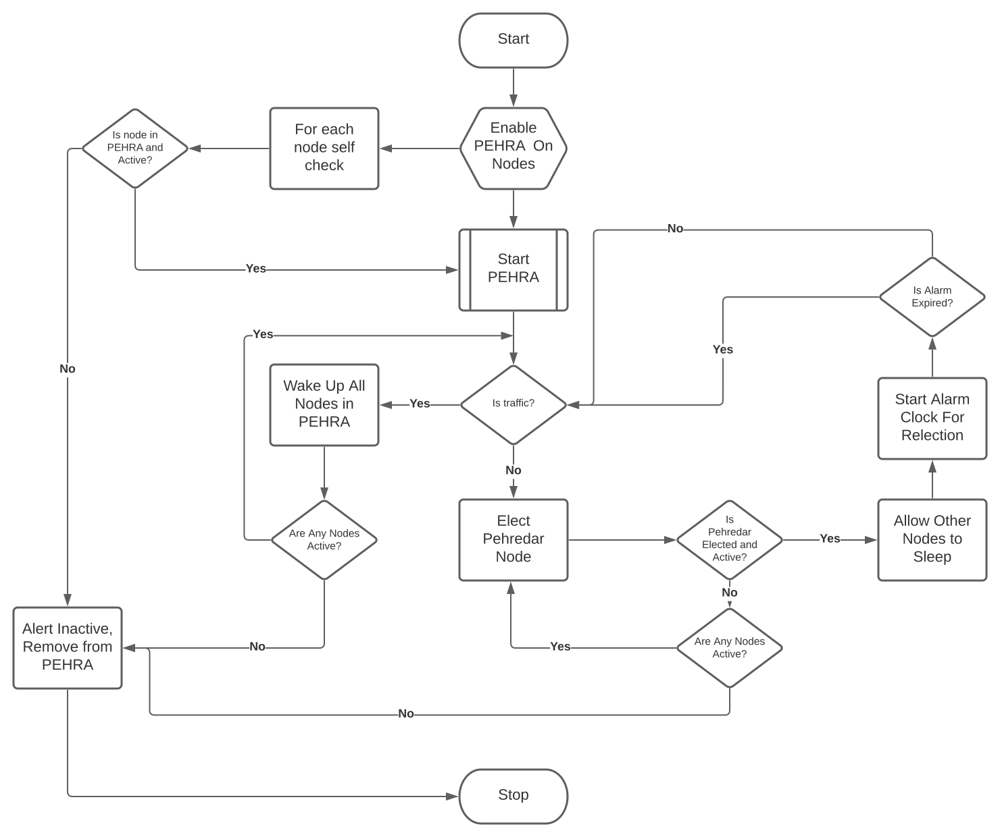

# P.E.H.R.A - Protocol for Energy Harvesting & Recovery Automation   

#COP26


## Kafka - PEHRA (Energy Saving Protocol for Kafka cluster) [When The Internet Sleeps](https://www.youtube.com/watch?v=HHAumsoMG3E)

In order to save energy consumption by keeping some nodes dormant in the kafka cluster a protocol is required for inter-node communication.


```Pehredar = election(random(nodes), term):```

All participating nodes entering in elections are choose randomly to dimish predictibility and attack on the Pehredar node (monitor node).


```alarmClock(nodes, intervals):```

All participating nodes in PEHRA, choose an interval at which they wakeUp() themselves  and see if there's an incoming request or current Pehredar node is active. If elected Pehredar node is not active, it will send a WakeUpAll(nodes) signal to participating nodes in PEHRA.

```wakeUpAll(nodes):```

Pehredar node sends wakeUpAll() signal to all dormant nodes when it start receiving traffic.


```reElection(nodes, term):```

All participating nodes reElect Pehredar node before the end of term length of Pehredar node at a pre-set interval.


```maintenance(nodes):```

All nodes except Pehredar go under maintenance one by one and choose new Pehredar via election before taking down current Pehredar.


```allDown(nodes):```

When all nodes go down for any reason, first node to become active becomes temp Pehredar and waits for all node to be active to participate in new election.

```sleepCycle(nodes, interval):```

All nodes except Pehredar node are allowed to sleep/hibernate for a specified amount of time when no traffic activity. A node can choose to be awake all time.


```disablePehra(Pehredar):```

Pehredar node can disable PEHRA mode and/or wakeUpAll() before doing so if it receives traffic of any kind.


```enablePehra(nodes)```

Only a human admin can enable/disable PEHRA mode at any moment for a given cluster after calling wakeUpAll().

```selfChk(node)```

All nodes can independently check if they are participant in PEHRA and stayAwake().


# Flow Chart



# Python Sim

````
> python3 pehra_sim.py

Usage: enter 0 to simulate no traffic condition, enter > 0 to simulate traffic condition

Node x Self check done... State: State.ACTIVE, Pehredar: False
Node y Self check done... State: State.ACTIVE, Pehredar: False
Node z Self check done... State: State.ACTIVE, Pehredar: False
1
Incoming task:  1
New task:  1
Task Node z, State.ACTIVE, with task 1
Node x Self check done... State: State.ACTIVE, Pehredar: False
Node z Self check done... State: State.ACTIVE, Pehredar: False
Node y Self check done... State: State.ACTIVE, Pehredar: False
1
Incoming task:  1
New task:  1
Task Node x, State.ACTIVE, with task 1
Node x Self check done... State: State.ACTIVE, Pehredar: False
Node z Self check done... State: State.ACTIVE, Pehredar: False
Node y Self check done... State: State.ACTIVE, Pehredar: False
0
Incoming task:  0
Nodes before allowed to sleep all:  ['Node: x, State: State.ACTIVE, Pehredar: False', 'Node: y, State: State.ACTIVE, Pehredar: False', 'Node: z, State: State.ACTIVE, Pehredar: False']
Current Pehredar: No Pehredar
New Pehredar:  x
Nodes after election:  ['Node: x, State: State.ACTIVE, Pehredar: True', 'Node: y, State: State.ACTIVE, Pehredar: False', 'Node: z, State: State.ACTIVE, Pehredar: False']
Nodes after allowed to sleep all:  ['Node: x, State: State.ACTIVE, Pehredar: True', 'Node: y, State: State.SLEEPING, Pehredar: False', 'Node: z, State: State.SLEEPING, Pehredar: False']
Node x Called Stay Awake, State: State.ACTIVE, Pehredar: True
Node y Self check done... State: State.SLEEPING, Pehredar: False
Node z Self check done... State: State.SLEEPING, Pehredar: False
Node x Self check done... State: State.ACTIVE, Pehredar: True
0
Incoming task:  0
Nodes before allowed to sleep all:  ['Node: x, State: State.ACTIVE, Pehredar: True', 'Node: y, State: State.SLEEPING, Pehredar: False', 'Node: z, State: State.SLEEPING, Pehredar: False']
Current Pehredar: x
New Pehredar:  z
Nodes after election:  ['Node: x, State: State.ACTIVE, Pehredar: False', 'Node: y, State: State.SLEEPING, Pehredar: False', 'Node: z, State: State.ACTIVE, Pehredar: True']
Nodes after allowed to sleep all:  ['Node: x, State: State.SLEEPING, Pehredar: False', 'Node: y, State: State.SLEEPING, Pehredar: False', 'Node: z, State: State.ACTIVE, Pehredar: True']
Node y Self check done... State: State.SLEEPING, Pehredar: False
Node z Called Stay Awake, State: State.ACTIVE, Pehredar: True
Node x Self check done... State: State.SLEEPING, Pehredar: False
Node z Self check done... State: State.ACTIVE, Pehredar: True
1
Incoming task:  1
New task:  1
Task Node x, State.SLEEPING, with task 1
Node z Called Stay Awake, State: State.ACTIVE, Pehredar: True
Node z Self check done... State: State.ACTIVE, Pehredar: True
Node y Self check done... State: State.SLEEPING, Pehredar: False
Node x Self check done... State: State.SLEEPING, Pehredar: False

````


